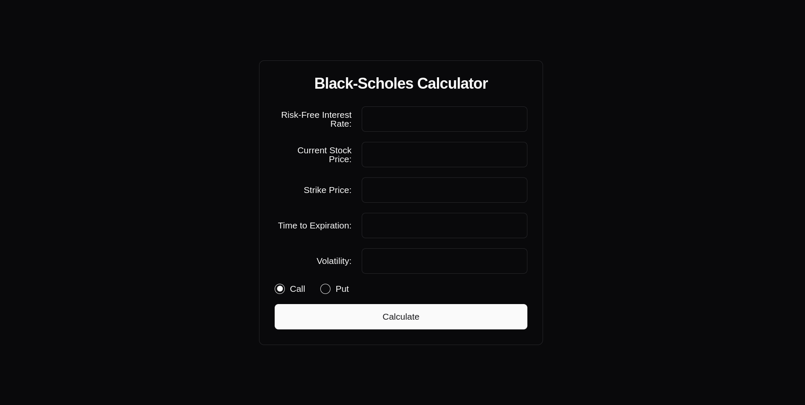

# README.md

# Black-Scholes Option Pricer (BSOP)



A fast and efficient option pricing tool built with Next.js frontend and Python FastAPI backend, dockerized for easy deployment.

## Prerequisites

- Docker
- Docker Compose

## Quick Start

1. Clone the repository:
   ```bash
   git clone https://github.com/adamDucken/bsop_next_fast.git
   cd bsop_next_fast
   ```

2. Run the setup script:
   ```bash
   chmod +x setup.sh
   ./setup.sh
   ```

3. Access the application:
   - Frontend: http://localhost:3000
   - Backend API: http://localhost:8000

   If you fail to access the app in these places, follow the instructions of the setup script.

## Usage

Enter the following parameters to calculate option prices:
- Stock price (decimal)
- Strike price (decimal)
- Time to maturity (in years)
- Risk-free rate (percentage as decimal, e.g., 5% → 0.05)
- Volatility (percentage as decimal)

The tool will calculate both call and put option prices using the Black-Scholes model.

## Architecture

- Frontend: Next.js with Tailwind CSS and Shadcn UI
- Backend: Python FastAPI
- Containerization: Docker and Docker Compose

## Development

To modify the services:
1. Update the code in `bsop_next` (frontend) or `bsop_fast` (backend)
2. Rebuild the containers:
   ```bash
   docker-compose down
   docker-compose up --build
   ```

**Note:** This project is under active development. Features and setup process may change.